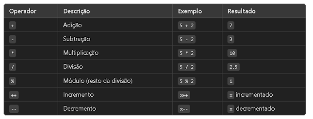
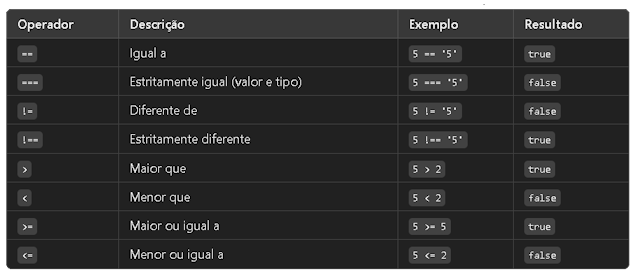
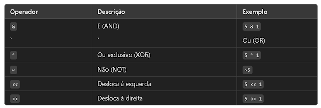
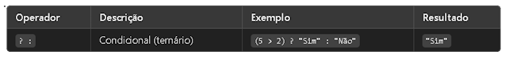
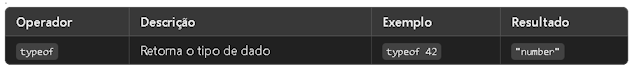

## Front-End - Introdução ao Javascript - Parte 1


### O que é Javascript?

Desenvolvida por Brendan Eich  em 1995, a pedido da empresa Netscape comprada pela America Online (AOL), com o objetivo de validar formulários HTML. <br>
Atualmente o JavaScript é uma poderosa linguagem de programação que pode adicionar interatividade a um site. Além disso é versátil e amigável para iniciantes. <br>
Com mais experiência na linguagem, você poderá criar jogos, gráficos 2D e 3D animados, aplicativos abrangentes baseados em banco de dados e muito mais!

### Afinal, onde o Javascript pode ser usado?

O Javascript é a linguagem mais utilizada para programação de aplicações Web e é suportada pela maioria dos navegadores (Firefox, Chrome, Edge e Safari) sem que o usuário precise instalar um plug-in.

### Sintaxe básica

* JavaScript pega emprestado a maior parte de sua sintaxe do Java, mas também é influenciado por Awk, Perl e Python.
* É case-sensitive e usa o conjunto de caracteres Unicode. Por exemplo, a palavra Früh (que significa "cedo" em Alemão) pode ser usada como nome de variável. Contudo früh não é a mesma que Früh porque JavaScript é case sensitive.

````js
var Früh = "Uma variavel";
var früh = "Outra variavel"
````

### Comentários

A sintaxe dos comentários em JavaScript é semelhante como em C++ e em muitas outras linguagens:

````js
// comentário de uma linha

/* isto é um comentário longo
   de múltiplas linhas.
 */

/* Você não pode, porém, /* aninhar comentários */ SyntaxError */
````

### Declarações

Existem três tipos de declarações em JavaScript: var, let e const

* var - Declara uma variável, opcionalmente, inicializando-a com um valor.

* let - Declara uma variável local de escopo do bloco, opcionalmente, inicializando-a com um valor.

* const - Declara uma constante de escopo de bloco, apenas de leitura.

A diferença entre var, let e const está relacionada ao escopo e à reatribuição de valores das variáveis. 

* var tem escopo de função e permite a redeclaração e reatribuição de valores.
* let tem escopo de bloco e permite a reatribuição de valores. 
* const tem escopo de bloco e declara uma variável de valor constante, que não pode ser alterada após a atribuição inicial.

Utilizando var, let e const -  Recomenda-se utilizar let ou const em vez de var na maioria dos casos, devido a questões relacionadas ao escopo e à legibilidade do código. 

* let deve ser utilizado quando você precisa reatribuir valores. 
* const deve ser utilizado quando você deseja declarar uma variável de valor constante.

### Variáveis

Você usa variáveis como nomes simbólicos para os valores em sua aplicação. O nome das variáveis, chamados de identificadores, obedecem determinadas regras.

Um identificador JavaScript deve começar com uma letra, underline (_), ou cifrão ($); os caracteres subsequentes podem também ser números (0-9). Devido JavaScript ser case-sensitive, letras incluem caracteres de "A" a "Z" (maiúsculos) e caracteres de "a" a "z" (minúsculos).

Você pode usar a ISO 8859-1 ou caracteres Unicode tal como os identificadores å e ü. Você pode também usar as sequências de escape Unicode como caracteres e identificadores.

Alguns exemplos de nomes legais são Numeros_visitas, temp99, e _nome.

1. Declarando variáveis

* Com a palavra chave var. Por exemplo, var x = 42. Esta sintaxe pode ser usada para declarar tanto variáveis locais como variáveis globais.
* Por simples adição de valor. Por exemplo, x = 42. Isso declara uma variável global. Essa declaração gera um aviso de advertência no JavaScript. Você não deve usar essa variante.
* Com a palavra chave let. Por exemplo, let y = 13. Essa sintaxe pode ser usada para declarar uma variável local de escopo de bloco. Veja escopo de variável abaixo.

Em JavaScript, as variáveis são declaradas utilizando as palavras-chave var, let ou const, seguidas pelo nome da variável. Por exemplo:

````js
var nome;
let idade;
const PI = 3.14;
````

O uso dessas palavras-chave determina o escopo e o comportamento da variável. A diferença entre let e const é que let permite a reatribuição de valores, enquanto const declara uma variável de valor constante, que não pode ser alterada após a atribuição inicial.

2. Atribuição de valores

* Para atribuir um valor a uma variável, basta utilizar o operador de atribuição =. Por exemplo:

````js
var nome = "João";
let idade = 25;
const PI = 3.14;
````

Também é possível atribuir valores a variáveis posteriormente:

````js
var nome;
nome = "João";
````

3. Escopo de variáveis

* O escopo de uma variável em JavaScript determina onde ela pode ser acessada e utilizada. Existem dois tipos de escopo: escopo global e escopo local.
* Variáveis declaradas fora de qualquer função têm escopo global e podem ser acessadas em qualquer parte do código.
* Variáveis declaradas dentro de uma função têm escopo local e só podem ser acessadas dentro dessa função.
* O uso das palavras-chave var, let e const também afeta o escopo das variáveis.

4. Tipos de dados

JavaScript é uma linguagem de tipagem dinâmica, o que significa que as variáveis podem conter diferentes tipos de dados ao longo da execução do código. Alguns dos tipos de dados mais comuns em JavaScript são:

* number: números (inteiros e decimais).
* string: texto.
* boolean: verdadeiro ou falso.
* array: coleção ordenada de valores.
* object: coleção de propriedades e valores.
* null: valor nulo.
* undefined: valor indefinido.


### Bonus - Boas práticas de nomenclatura

Ao nomear variáveis em JavaScript, é importante seguir algumas boas práticas para tornar o código mais legível e compreensível. Aqui estão algumas dicas:

* Use nomes descritivos que reflitam o propósito da variável.
* Utilize camel case para nomes compostos (exemplo: nomeCompleto).
* Evite nomes genéricos ou abreviações que possam levar a ambiguidades.
* Evite utilizar palavras reservadas da linguagem como nomes de variáveis.


### Primeiro Programa e Javascript

Vamos iniciar utlizando o site [One Compiler](https://onecompiler.com/javascript) para compilar o codigo a seguir:

````js
console.log("Hello, World!");
````

### Operadores

JavaScript possui uma variedade de operadores que são usados para realizar diferentes operações em valores, variáveis e expressões. Aqui estão os principais operadores, divididos em categorias:

1. Operadores Aritméticos

* Usados para realizar operações matemáticas.



Exemplo:

````js
let a = 10;
let b = 3;

console.log(a + b);  // Adição: 13
console.log(a - b);  // Subtração: 7
console.log(a * b);  // Multiplicação: 30
console.log(a / b);  // Divisão: 3.333...
console.log(a % b);  // Módulo: 1
console.log(++a);    // Incremento: 11 (incrementa antes de mostrar o valor)
console.log(--b);    // Decremento: 2 (decrementa antes de mostrar o valor)
````

2. Operadores de Atribuição

* Usados para atribuir valores a variáveis.


Exemplo:
````js
let x = 5;

x += 2;   // x = x + 2;  Agora x é 7
x -= 1;   // x = x - 1;  Agora x é 6
x *= 3;   // x = x * 3;  Agora x é 18
x /= 6;   // x = x / 6;  Agora x é 3
x %= 2;   // x = x % 2;  Agora x é 1
console.log(x); // Resultado final: 1
````

3. Operadores de Comparação

* Usados para comparar valores e retornar true ou false.



Exemplo:
````js
let c = 5;
let d = '5';

console.log(c == d);   // Igual a: true (só compara valores)
console.log(c === d);  // Estritamente igual: false (compara valor e tipo)
console.log(c != d);   // Diferente de: false
console.log(c !== d);  // Estritamente diferente: true
console.log(c > 3);    // Maior que: true
console.log(c < 10);   // Menor que: true
console.log(c >= 5);   // Maior ou igual a: true
console.log(c <= 2);   // Menor ou igual a: false
````

4. Operadores Lógicos

* Usados para combinar expressões booleanas.


Exemplo:
````js
let e = true;
let f = false;

console.log(e && f);   // E (AND): false (apenas true se ambos forem true)
console.log(e || f);   // Ou (OR): true (true se um dos dois for true)
console.log(!e);       // Não (NOT): false (inverte o valor)
console.log(!f);       // Não (NOT): true
````

5. Operadores Bit a Bit

* Usados para operações em nível de bit (binário).



Exemplo:
````js
let g = 5;   // Em binário: 0101
let h = 1;   // Em binário: 0001

console.log(g & h);   // E (AND): 1 (0101 & 0001 = 0001)
console.log(g | h);   // Ou (OR): 5 (0101 | 0001 = 0101)
console.log(g ^ h);   // Ou exclusivo (XOR): 4 (0101 ^ 0001 = 0100)
console.log(~g);      // Não (NOT): -6 (inverte todos os bits)
console.log(g << 1);  // Desloca à esquerda: 10 (1010 em binário)
console.log(g >> 1);  // Desloca à direita: 2 (0010 em binário)
````

6. Operador Ternário

* Usado para realizar uma verificação condicional em uma linha.



Exemplo:
````js
let idade = 18;
let podeDirigir = (idade >= 18) ? "Sim, pode dirigir" : "Não, não pode dirigir";
console.log(podeDirigir);  // Resultado: "Sim, pode dirigir"
````

7. Operador de Tipo (typeof)

* Usado para verificar o tipo de uma variável ou valor.



Exemplo:
````js
let numero = 42;
let texto = "Olá";
let booleano = true;

console.log(typeof numero);    // Resultado: "number"
console.log(typeof texto);     // Resultado: "string"
console.log(typeof booleano);  // Resultado: "boolean"
console.log(typeof undefined); // Resultado: "undefined"
console.log(typeof null);      // Resultado: "object" (um detalhe do JavaScript)
````

### Estrutura  Condicionais 

Em JavaScript, as estruturas condicionais permitem executar blocos de código com base em uma condição. As mais comuns são if, else if, else e switch.

#### if, else if, else

Essa estrutura é usada para verificar se uma condição é verdadeira e, em caso positivo, executar um bloco de código. Caso contrário, é possível definir uma ação alternativa com o else.

````js
if (condicao) {
    // Código a ser executado se a condição for verdadeira
} else if (outraCondicao) {
    // Código a ser executado se a segunda condição for verdadeira
} else {
    // Código a ser executado se nenhuma das condições anteriores for verdadeira
}
````

Na prática:<br>
Vamos criar um exemplo em que verificamos a faixa etária de uma pessoa e mostramos uma mensagem diferente dependendo da idade.

````js
let idade = 20;

if (idade < 12) {
    console.log("Você é uma criança.");
} else if (idade >= 12 && idade < 18) {
    console.log("Você é um adolescente.");
} else if (idade >= 18 && idade < 60) {
    console.log("Você é um adulto.");
} else {
    console.log("Você é idoso.");
}
````

### switch

A estrutura switch é útil quando temos várias condições que dependem de um único valor, como o valor de uma variável específica. Em vez de usar vários else if, podemos simplificar o código com switch.

````js
switch (expressao) {
    case valor1:
        // Código a ser executado se expressao === valor1
        break;
    case valor2:
        // Código a ser executado se expressao === valor2
        break;
    default:
        // Código a ser executado se nenhum dos casos anteriores for atendido
}
````

Na prática<br>
Vamos criar um exemplo em que verificamos o dia da semana e exibimos uma mensagem correspondente.

````js
let diaSemana = 3;  // Suponha que 1 = Segunda, 2 = Terça, ..., 7 = Domingo

switch (diaSemana) {
    case 1:
        console.log("Hoje é Segunda-feira.");
        break;
    case 2:
        console.log("Hoje é Terça-feira.");
        break;
    case 3:
        console.log("Hoje é Quarta-feira.");
        break;
    case 4:
        console.log("Hoje é Quinta-feira.");
        break;
    case 5:
        console.log("Hoje é Sexta-feira.");
        break;
    case 6:
        console.log("Hoje é Sábado.");
        break;
    case 7:
        console.log("Hoje é Domingo.");
        break;
    default:
        console.log("Número inválido. Escolha um número entre 1 e 7.");
}
````

### Estrutura  de Repetição

Executam um bloco de código repetidamente enquanto uma condição for verdadeira.

#### for

````js
for (let i = 0; i < 5; i++) {
    console.log(i);  // Saída: 0, 1, 2, 3, 4
}
````

#### While

````js
let contador = 0;
while (contador < 5) {
    console.log(contador);
    contador++;
}
````

#### Do..While

````js
let numero = 0;
do {
    console.log(numero);
    numero++;
} while (numero < 5);
````

### Funções

Permitem agrupar e reutilizar código. Podem receber parâmetros e retornar valores.

````js
function saudacao(nome) {
    return "Olá, " + nome + "!";
}

console.log(saudacao("Pedro")); // Saída: "Olá, Pedro!"
````

### Arrays 

Arrays são listas de valores.

````js
let frutas = ["maçã", "banana", "laranja"];
frutas.push("uva");        // Adiciona ao final
console.log(frutas[1]);     // Saída: "banana"
frutas.pop();               // Remove o último elemento
````

### Objetos

Objetos armazenam dados como pares chave: valor.

````js
let pessoa = {
    nome: "João",
    idade: 30,
    cidade: "São Paulo"
};

console.log(pessoa.nome);   // Saída: "João"
pessoa.idade = 31;          // Modifica o valor da propriedade
````

### Console Log

Usado para imprimir mensagens no console do navegador ou ambiente de desenvolvimento.

````js
console.log("Hello, world!"); // Saída: "Hello, world!"
````

### alert, prompt e confirm

Esses comandos são usados para interagir com o usuário.

````js
alert("Bem-vindo!");                  // Exibe uma mensagem de alerta
let nomeUsuario = prompt("Qual é o seu nome?"); // Solicita um valor ao usuário
let resposta = confirm("Você tem certeza?");    // Retorna `true` ou `false`
````